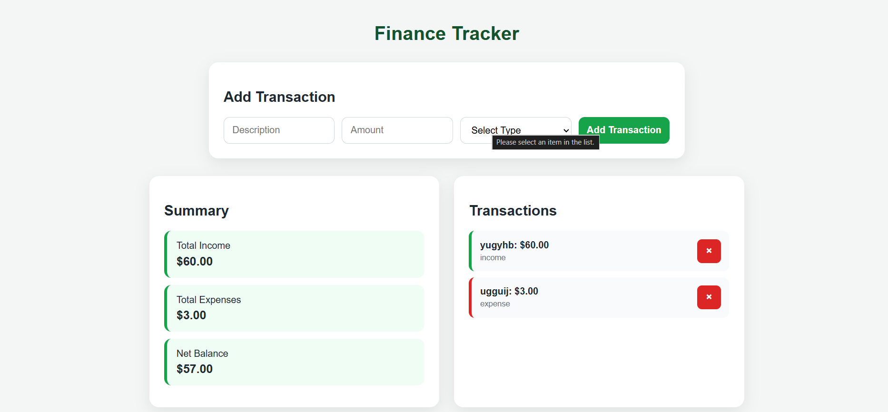

# Finance Tracker

Responsive finance tracker application built with HTML, CSS, JAVASCRIPT, and dynamic DOM manipulation.

## Features

- Add income and expense transactions
- Calculate total income
- Calculate total expenses
- Calculate net balance
- Delete transactions
- Dynamic updates using JavaScript

## Technologies Used

- HTML
- CSS
- JavaScript

## What I Learned

- DOM manipulation
- Arrays and objects
- Event listeners
- createElement()
- appendChild()
- classList.add()
- Dynamic rendering
- Updating UI with JavaScript

- 
## Live Demo

https://stephaniesantos8.github.io/finance-tracker-js/

## Screenshot

